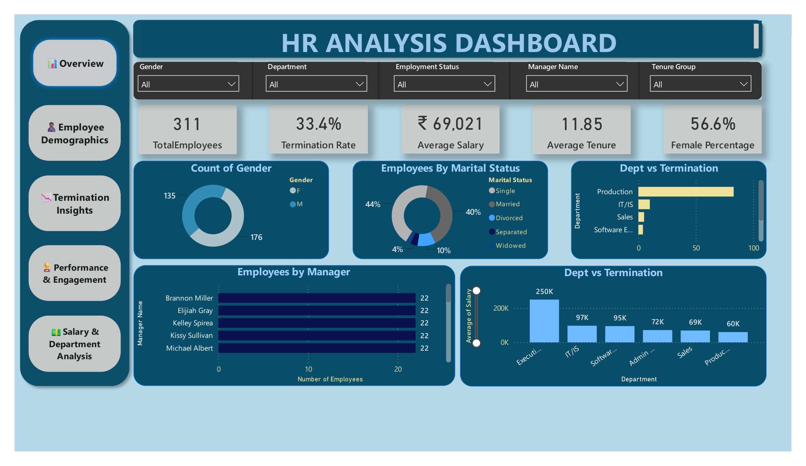
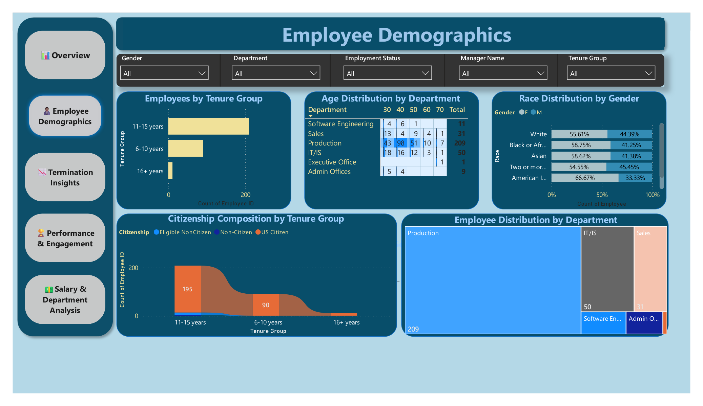
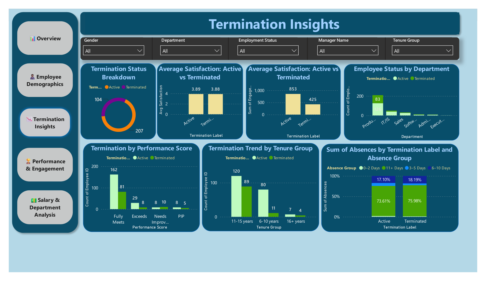
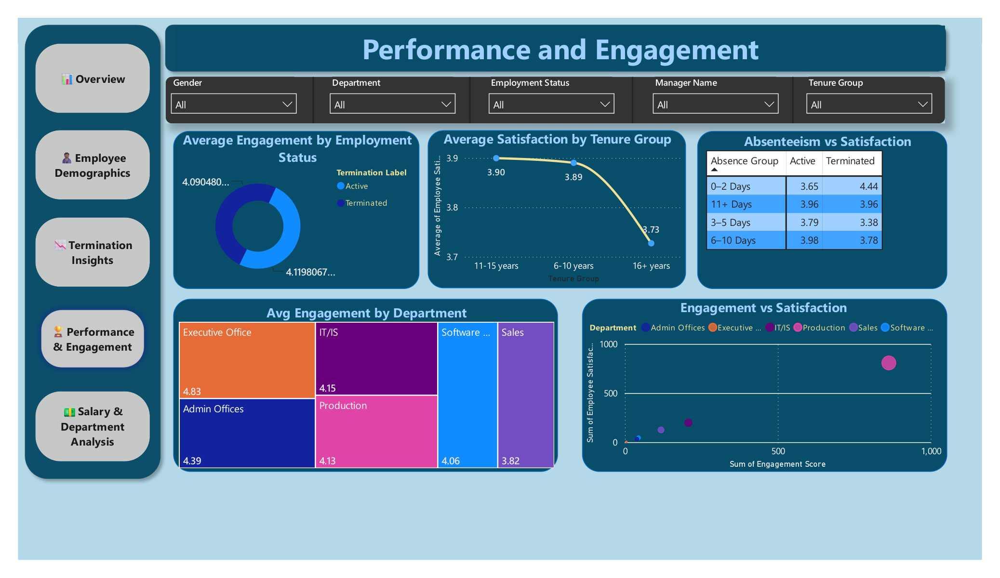
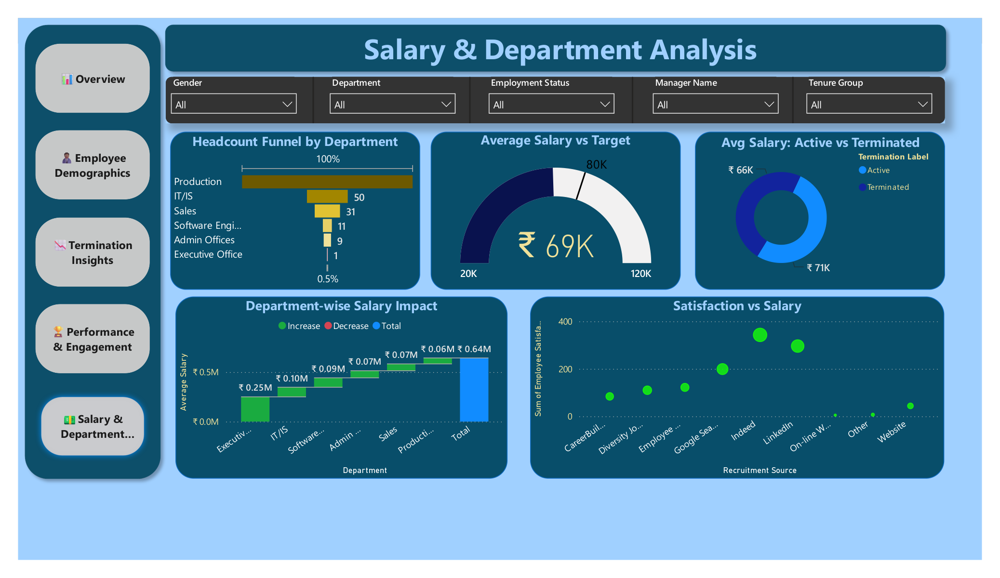

# 💼 HR Analytics Project (Power BI + Python)

A complete HR data analysis project using **Power BI** and **Python** (Pandas, Seaborn, Matplotlib) to generate deep workforce insights across departments, salary, performance, engagement, and attrition.

---

## 📊 Tools Used
- Power BI (Dashboards, Visuals, DAX)
- Python (Jupyter Notebook, Pandas, Seaborn)
- Excel (Raw HR Dataset)

---

## 📁 Project Structure

| File | Description |
|------|-------------|
| `HR_Analysis_Dashboard.pbix` | Power BI dashboard with 5 interactive pages |
| `HR_Analysis.ipynb` | Python-based EDA and visualizations |
| `HR_Dataset.xlsx` | HR dataset used for analysis |
| `README.md` | Full project summary |
| `images/` | Screenshots of the dashboard pages |

---

## 📈 Dashboard Pages

### 1. Overview – KPIs, Gender/Marital Stats, Manager Breakdown

### 2. Demographics – Age, Tenure, Citizenship, Race, Department

### 3. Termination Insights – Attrition by Tenure, Performance, Absenteeism

### 4. Performance & Engagement – Satisfaction, Engagement, Matrix Heatmap

### 5. Salary & Department – Funnel, Waterfall, Gauge, Salary Comparison

---

## 🔍 Key Insights
- 📉 33.4% employees terminated (Production dept highest)
- 💬 Engagement correlates positively with Satisfaction (+0.19)
- 🏆 Admin dept has highest engagement; Executive has lowest satisfaction
- 💰 Avg Salary: ₹69,020 | Total Paid: ₹21.46M
- 🚩 High absenteeism linked to low satisfaction in terminations

---

> Built a 5-page Power BI dashboard + Python analysis to uncover salary trends, attrition patterns, and performance insights from a 300+ employee HR dataset using DAX, advanced visuals, and storytelling design.

---

## 🧠 Author
**Harshil Mistry**
Data Analyst | Python | Power BI | SQL
[LinkedIn](https://linkedin.com/in/harshil-mistry-) | [GitHub](https://github.com/Harshil-Mistry027)
